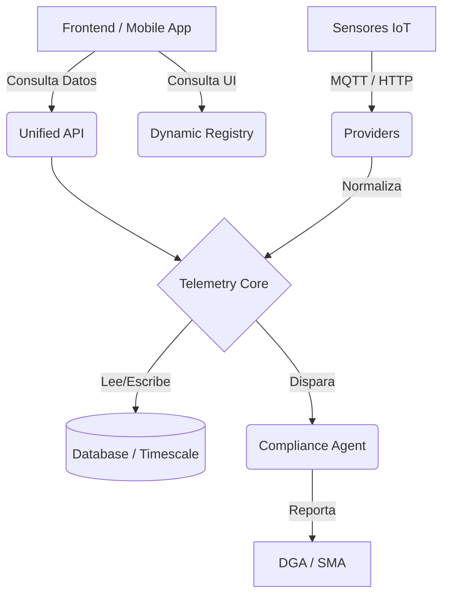

# Sistema de Agentes: Arquitectura de Responsabilidades

Este documento detalla la separación de "Agentes" (Módulos) dentro de SmartHydro y sus responsabilidades específicas.

| Agente / Módulo                               | Nivel / Capa           | Responsabilidad Principal                                                                          | Interacciones Clave                                                                        |
| :-------------------------------------------- | :--------------------- | :------------------------------------------------------------------------------------------------- | :----------------------------------------------------------------------------------------- |
| **Unified API** (`api.unified`)               | **Gateway (V0)**       | Punto de entrada único y limpio para Frontend/Apps. Abstrae la complejidad interna.                | Consume `StatusService`, `CatchmentPoint`, `Device`. Expone `/api/points`, `/api/devices`. |
| **Dynamic Registry** (`api.dynamic_registry`) | **UI Orchestration**   | Define *cómo* se ve el Frontend (Server-Driven UI). Entrega configuraciones JSON de Menú y Vistas. | Configura `/api/registry/modules`. No maneja datos, solo estructura.                       |
| **Telemetry Core** (`api.telemetry`)          | **Processing Engine**  | Ingesta, procesa y almacena datos de sensores. Ejecuta el `FormulaEngine`.                         | Recibe de `providers`, guarda `TelemetryRecord`. Calcula caudal/nivel.                     |
| **Compliance** (`api.compliance`)             | **Regulatory**         | Garantiza el cumplimiento legal (DGA/SMA). Separa la lógica de negocio de la normativa.            | Lee `TelemetryRecord`, genera XML/JSON, envía a entes externos.                            |
| **Infrastructure** (`api.infrastructure`)     | **Hardware Layer**     | Inventario físico de equipos. Gestiona tokens de autenticación y modelos de dispositivos.          | Vincula `Device` con `CatchmentPoint`. Genera `device_token` para MQTT.                    |
| **Dashboard** (`api.core.views.dashboard`)    | **Aggregation**        | Agrega datos para visualización ejecutiva. Estadísticas y tendencias batch.                        | Consume múltiples `TelemetryRecord` y `Notifications`.                                     |
| **Providers** (`api.telemetry.providers`)     | **Ingestion Strategy** | Adaptadores para diferentes fuentes de datos (MQTT, API, Scrapers).                                | Normaliza datos externos al formato interno de SmartHydro.                                 |

## Flujo de Interacción Simplificado

