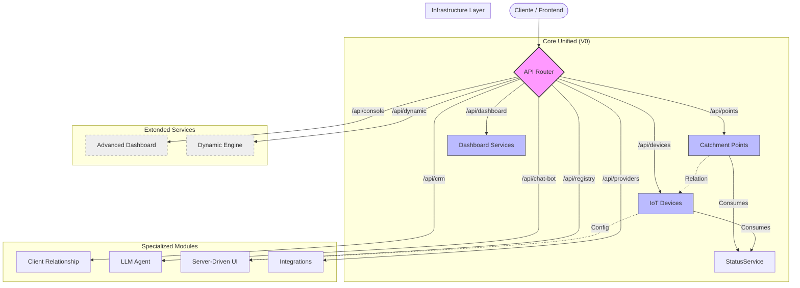

# Arquitectura de la API: Mapa Visual

Este diagrama ilustra la estructura actual de los endpoints en SmartHydro, destacando la unificación y la coexistencia con módulos legacy/especializados.

## Leyenda
- **Core Unified (Azul)**: Endpoints modernos y centralizados.
- **Extended Services (Gris)**: Servicios avanzados de consola y motor dinámico.
- **Specialized Modules**: Apps independientes con dominios específicos.
