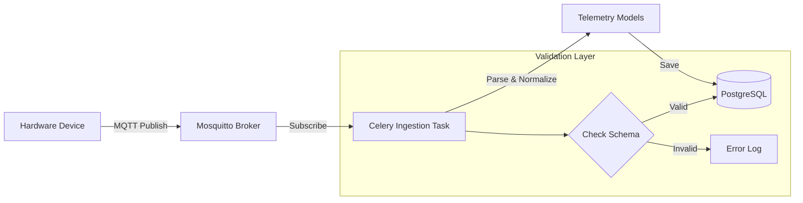
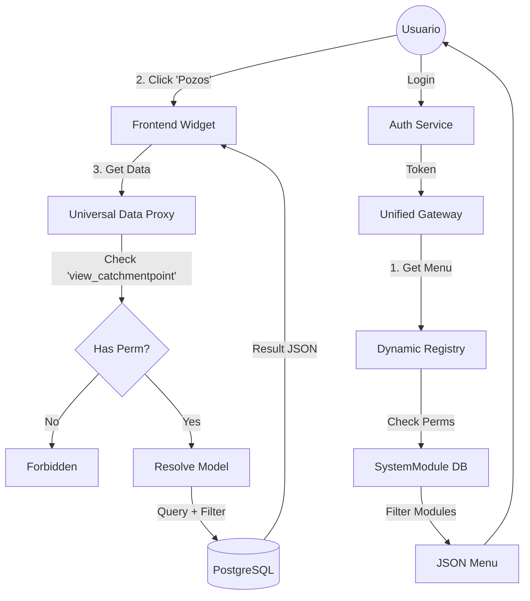

# Trazabilidad de Datos & Control de Acceso

Este diagrama explica cómo viaja un dato desde el hardware hasta la pantalla del usuario, y cómo el sistema decide qué mostrar.

## 1. Definición de Roles (User Types)

SmartHydro maneja 3 arquetipos de usuario principales:

| Rol                     | Descripción                                         | Permisos Clave                                               |
| :---------------------- | :-------------------------------------------------- | :----------------------------------------------------------- |
| **Cliente / User**      | Dueño de los pozos. Solo ve sus datos.              | `view_dashboard`, `view_catchmentpoint` (Filtered by Tenant) |
| **Operador (Internal)** | Equipo de Soporte/Hardware. Configura dispositivos. | `change_device`, `view_telemetry_raw`, `manage_alerts`       |
| **Admin / CRM**         | Gestión Comercial. Facturación y altas.             | `view_client`, `add_subscription`, `view_auditlog`           |

## 2. Flujo de Datos (Device -> DB)

## 3. Flujo de Visualización (DB -> User Screen)

Aquí es donde **Dynamic Registry** actúa como el "Portero".

## 4. Auditoría (Traceability)

Cada acción de escritura (Create/Update/Delete) genera una "sombra":

*   **Usuario**: `juan.perez@cliente.com`
*   **Acción**: `UPDATE`
*   **Recurso**: `AlertConfig (ID: 55)`
*   **Cambio**: `limit: 50 -> 60`
*   **Timestamp**: `2026-01-24 18:30:00`

Esto queda grabado en la tabla `AuditLog` y es consultable solo por usuarios con permiso `view_auditlog`.
