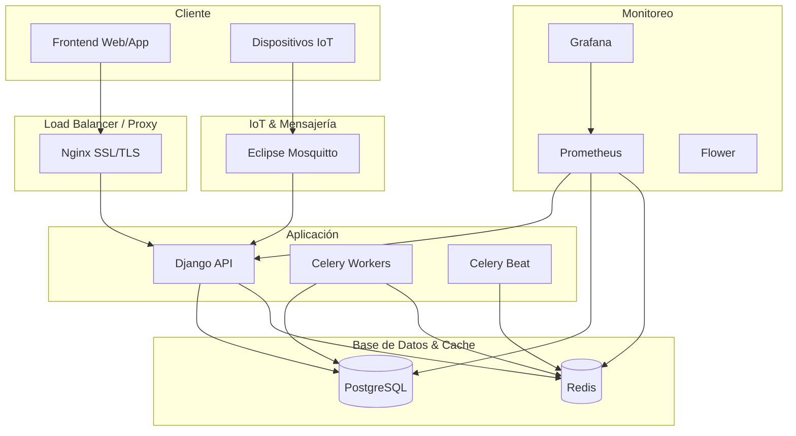

# 🚀 Guía de Deployment a Producción - SmartHydro

## 📋 Resumen Ejecutivo

Esta guía detalla el despliegue completo de SmartHydro en un entorno de producción empresarial. El sistema incluye:

- **API Django REST Framework** con optimizaciones de rendimiento
- **PostgreSQL** con configuraciones de alta performance
- **Redis** para cache y message broker
- **Celery** para procesamiento distribuido
- **MQTT Broker integrado** para IoT
- **Nginx** con SSL/TLS
- **Monitoreo** con Prometheus y Grafana
- **Sistema de backup automático**

## 🏗️ Arquitectura de Producción



## 📋 Prerrequisitos

### Requisitos del Sistema
- **Servidor**: Ubuntu 20.04+ / CentOS 7+ / Debian 10+
- **CPU**: 4+ cores
- **RAM**: 8GB+ (16GB recomendado)
- **Disco**: 50GB+ SSD
- **Red**: 100Mbps+

### Software Requerido
- Docker 20.10+
- Docker Compose 2.0+
- Git
- curl/wget
- OpenSSL (para certificados)

### Certificados SSL
```bash
# Crear directorio para certificados
mkdir -p ssl

# Generar certificado auto-firmado (solo para testing)
openssl req -x509 -newkey rsa:4096 -keyout ssl/smarthydro.key -out ssl/smarthydro.crt -days 365 -nodes -subj "/CN=api.smarthydro.app"

# Para producción: usar Let's Encrypt o certificados comerciales
```

## 🔧 Configuración Inicial

### 1. Clonar y Configurar
```bash
# Clonar repositorio
git clone https://github.com/tu-organizacion/smarthydro.git
cd smarthydro

# Hacer ejecutables los scripts
chmod +x deploy.production.sh monitor.production.sh

# Configurar variables de entorno
cp env.production.example .env
nano .env  # Editar todas las variables requeridas
```

### 2. Variables de Entorno Críticas
```bash
# Archivo .env - CONFIGURAR TODAS LAS VARIABLES

# Django
DJANGO_SECRET_KEY=tu_clave_muy_segura_32_caracteres_minimo
DJANGO_DEBUG=False

# Base de datos
POSTGRES_DB=smarthydro_prod
POSTGRES_USER=smarthydro_user
POSTGRES_PASSWORD=tu_password_muy_seguro_para_postgres

# Email
EMAIL_HOST=smtp.tu-proveedor.com
EMAIL_HOST_USER=tu-email@tu-dominio.com
EMAIL_HOST_PASSWORD=tu_password_de_email

# APIs externas
GEMINI_API_KEY=tu_api_key_de_google_gemini

# MQTT
MQTT_BROKER_USERNAME=smarthydro
MQTT_BROKER_PASSWORD=tu_password_mqtt_seguro

# Monitoreo
GRAFANA_ADMIN_PASSWORD=tu_password_grafana_seguro
```

## 🚀 Deployment Automático

### Opción 1: Deployment Completo (Recomendado)
```bash
# Deployment completo automatizado
./deploy.production.sh deploy
```

### Opción 2: Deployment Paso a Paso

#### Paso 1: Verificar Prerrequisitos
```bash
./deploy.production.sh infrastructure
```

#### Paso 2: Setup Inicial
```bash
./deploy.production.sh setup
```

#### Paso 3: Iniciar Aplicación
```bash
./deploy.production.sh start
```

### Verificar Deployment
```bash
# Ejecutar monitoreo completo
./monitor.production.sh

# Ver logs en tiempo real
./deploy.production.sh logs django_app
```

## 🌐 Acceso al Sistema

### URLs de Producción
```
🌐 API Principal:     https://api.smarthydro.app/
👑 Admin Django:      https://api.smarthydro.app/admin/
📊 Monitoreo Flower:  https://api.smarthydro.app/flower/
📈 Grafana:           http://tu-servidor:3000
📊 Prometheus:        http://tu-servidor:9090
🔌 MQTT Broker:       mqtt://tu-servidor:1883
```

### Credenciales Iniciales
```
👤 Usuario Admin: admin
🔑 Password: admin123 (¡CAMBIAR INMEDIATAMENTE!)
```

## 🔍 Monitoreo y Mantenimiento

### Comandos de Monitoreo
```bash
# Estado completo del sistema
./monitor.production.sh

# Ver logs específicos
./deploy.production.sh logs django_app
./deploy.production.sh logs celery_worker
./deploy.production.sh logs postgres

# Estado de servicios
./deploy.production.sh status
```

### Tareas de Mantenimiento
```bash
# Backup manual
./deploy.production.sh backup

# Reiniciar servicios
./deploy.production.sh restart

# Detener todo
./deploy.production.sh stop
```

### Monitoreo con Grafana
1. Acceder a `http://tu-servidor:3000`
2. Usuario: `admin`
3. Importar dashboards de `monitoring/grafana/dashboards/`

## 🔧 Configuraciones Avanzadas

### Optimización de PostgreSQL
```sql
-- Conexión a PostgreSQL
docker-compose -f docker-compose.production.yml exec postgres psql -U smarthydro_user -d smarthydro_prod

-- Ver configuración actual
SHOW ALL;

-- Ajustar según necesidades
ALTER SYSTEM SET work_mem = '64MB';
ALTER SYSTEM SET maintenance_work_mem = '512MB';
SELECT pg_reload_conf();
```

### Escalado de Celery Workers
```yaml
# En docker-compose.production.yml
celery_worker:
  deploy:
    replicas: 4  # Aumentar según carga
```

### Backup Automático
```bash
# Configurar cron para backups diarios
crontab -e

# Agregar línea:
0 2 * * * cd /ruta/a/smarthydro && ./deploy.production.sh backup
```

## 🚨 Solución de Problemas

### Problemas Comunes

#### 1. Error de Conexión a Base de Datos
```bash
# Verificar estado de PostgreSQL
docker-compose -f docker-compose.production.yml logs postgres

# Reiniciar PostgreSQL
docker-compose -f docker-compose.production.yml restart postgres
```

#### 2. Error de Memoria en Celery
```bash
# Verificar uso de memoria
docker stats

# Ajustar límites en docker-compose.production.yml
celery_worker:
  deploy:
    resources:
      limits:
        memory: 2G
      reservations:
        memory: 1G
```

#### 3. Problemas de SSL
```bash
# Verificar certificados
openssl x509 -in ssl/smarthydro.crt -text -noout

# Verificar configuración de Nginx
docker-compose -f docker-compose.production.yml logs nginx_proxy
```

#### 4. MQTT No Conecta
```bash
# Verificar estado del broker
docker-compose -f docker-compose.production.yml logs mqtt_broker

# Probar conexión
mosquitto_sub -h localhost -p 1883 -t "test" -C 1
```

### Logs de Debugging
```bash
# Logs completos
docker-compose -f docker-compose.production.yml logs

# Logs de aplicación específicos
docker-compose -f docker-compose.production.yml logs django_app | tail -100

# Buscar errores
docker-compose -f docker-compose.production.yml logs | grep -i error
```

## 🔄 Actualizaciones y Rollbacks

### Actualización de Código
```bash
# Backup antes de actualizar
./deploy.production.sh backup

# Actualizar código
git pull origin main

# Reconstruir y reiniciar
docker-compose -f docker-compose.production.yml build --no-cache
docker-compose -f docker-compose.production.yml up -d

# Ejecutar migraciones si es necesario
docker-compose -f docker-compose.production.yml run --rm django_app python manage.py migrate
```

### Rollback de Emergencia
```bash
# Detener servicios
docker-compose -f docker-compose.production.yml down

# Restaurar backup
# (Implementar según estrategia de backup)

# Reiniciar con versión anterior
git checkout v1.0.0
docker-compose -f docker-compose.production.yml up -d
```

## 📊 Métricas de Performance

### KPIs a Monitorear
- **Latencia API**: <500ms promedio
- **Disponibilidad**: >99.9%
- **Throughput**: >1000 requests/min
- **Error Rate**: <0.1%
- **Uso de CPU**: <70%
- **Uso de Memoria**: <80%
- **Conexiones DB**: <100 concurrentes

### Alertas Recomendadas
- Error rate > 5%
- Latencia > 2s
- CPU > 90%
- Memoria > 90%
- Disco > 85%
- Conexiones DB > 150

## 🔐 Seguridad

### Checklist de Seguridad
- [ ] Certificados SSL válidos
- [ ] Contraseñas fuertes configuradas
- [ ] Firewall configurado
- [ ] Acceso SSH con llaves
- [ ] Backups encriptados
- [ ] Logs auditados
- [ ] Actualizaciones de seguridad regulares

### Configuración de Firewall
```bash
# UFW (Ubuntu)
sudo ufw enable
sudo ufw allow 80
sudo ufw allow 443
sudo ufw allow 1883  # MQTT
sudo ufw allow 22    # SSH (restringir IPs)
```

## 📞 Soporte

### Contactos de Emergencia
- **Administrador Sistema**: admin@tu-empresa.com
- **Equipo Desarrollo**: dev@tu-empresa.com
- **Soporte 24/7**: soporte@tu-empresa.com

### Documentación Adicional
- [API Documentation](./api/README.md)
- [Troubleshooting Guide](./TROUBLESHOOTING.md)
- [Security Guidelines](./SECURITY.md)

---

## ✅ Checklist Final de Deployment

- [ ] Servidor provisionado con requisitos mínimos
- [ ] Docker y Docker Compose instalados
- [ ] Repositorio clonado y configurado
- [ ] Variables de entorno configuradas
- [ ] Certificados SSL generados/instalados
- [ ] Deployment ejecutado exitosamente
- [ ] Todos los servicios funcionando
- [ ] Monitoreo configurado y operativo
- [ ] Backup inicial realizado
- [ ] Acceso administrativo verificado
- [ ] Documentación de acceso compartida

**🎉 ¡SmartHydro está listo para producción!**